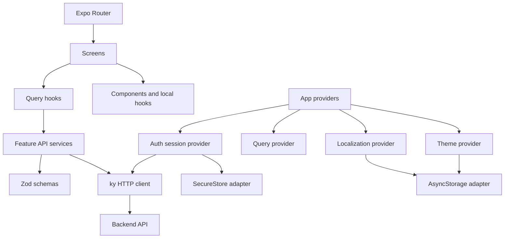

# Expo React Native Boilerplate


A production-ready, opinionated Expo + React Native architecture for building scalable cross-platform mobile applications.

This repository translates the separation of concerns and developer experience of mature React Native boilerplates into an Expo-first workflow: Expo Router for navigation, Continuous Native Generation for native projects, EAS for builds and updates, and typed modules for every external boundary.

## Features

- Expo SDK 57, React Native 0.86.3, React 19.2.3, and Expo Router 57
- Android, iOS, and static web output from one codebase
- Thin, typed Expo Router routes with deep-link and not-found handling
- Strict TypeScript with the `@/*` source alias
- Accessible, theme-aware component primitives
- Persistent system/light/dark theme selection
- Device-aware English/French localization with a persisted override
- TanStack Query server state with cancellation and retry policy
- A ky client with timeout, authorization injection, and normalized errors
- Zod runtime validation at the API boundary
- AsyncStorage and SecureStore behind swappable service abstractions
- Authentication-ready session provider and logout cleanup
- Global production-safe error boundary
- Splash-screen coordination without artificial delays
- Reanimated interaction and entrance examples
- Jest, React Native Testing Library, ESLint, Prettier, and Expo Doctor
- EAS Build profiles, update channels, GitHub Actions, Dependabot, and Maestro
- Interactive and non-interactive project identity setup

## Why this boilerplate

The default Expo template is intentionally small. A growing product also needs clear answers to where network code, runtime validation, screen UI, preferences, error handling, and tests belong. This starter establishes those boundaries while the codebase is still easy to understand.

Its principles are:

- **Separation of concerns:** routing, UI, server state, transport, validation, and persistence stay independently testable.
- **Expo-first:** use Expo modules, config plugins, CNG, and EAS instead of checked-in native projects.
- **Server-state separation:** TanStack Query owns remote state; React context is reserved for narrow app-wide concerns.
- **Runtime validation:** data from storage and APIs is untrusted until checked.
- **Storage abstraction:** consumers do not depend on AsyncStorage or SecureStore directly.
- **Thin routes:** `app/` coordinates URLs; `src/screens/` implements screens.
- **Minimal magic:** explicit modules and ordinary functions are preferred over framework-heavy abstractions.

## Tech stack

| Area         | Choice                                              |
| ------------ | --------------------------------------------------- |
| Runtime      | Expo SDK 57, React Native 0.86.3, React 19.2.3      |
| Routing      | Expo Router 57 with typed routes                    |
| Server state | TanStack Query 5                                    |
| HTTP         | ky 2                                                |
| Validation   | Zod 4                                               |
| Localization | i18next, react-i18next, expo-localization           |
| Persistence  | AsyncStorage and expo-secure-store                  |
| Animation    | React Native Reanimated 4                           |
| Testing      | Jest 29, jest-expo, React Native Testing Library 14 |
| Delivery     | EAS Build/Update-ready config and GitHub Actions    |

## Requirements

- Node.js 22.13 or newer
- npm 10 or newer
- Expo Go for the fastest local start
- Xcode for an iOS simulator or local iOS build
- Android Studio for an Android emulator or local Android build
- An Expo account only for EAS cloud services, not local development

## Quick start

```bash
git clone <repository-url> my-app
cd my-app
npm install
npm run setup
npm start
```

The setup script prompts for the display name, slug, Apple bundle identifier, Android package, URL scheme, and optionally an API URL supplied as a flag.

## Project setup

Interactive setup:

```bash
npm run setup
```

Non-interactive setup:

```bash
npm run setup -- \
  --name "My Awesome App" \
  --slug my-awesome-app \
  --bundle-id com.example.myawesomeapp \
  --package com.example.myawesomeapp \
  --scheme myawesomeapp \
  --api-url https://api.example.com
```

Preview validation without writing:

```bash
npm run setup -- --name "My App" --slug my-app --dry-run
```

Identity values live in structured `app.identity.json`; `app.config.ts` consumes that file. The script does not perform broad source-code replacements.

## Running Android

```bash
npm run android
```

Start Metro first if you prefer to launch the emulator manually:

```bash
npm start
```

## Running iOS

```bash
npm run ios
```

An iOS simulator requires macOS and Xcode. A physical device can use Expo Go by scanning the Metro QR code.

## Running Web

```bash
npm run web
```

Validate the production static bundle with:

```bash
npm run export:web
```

## Expo Go and development builds

The example application uses libraries available in Expo Go. Start there for the shortest feedback loop:

```bash
npm start
```

`expo-dev-client` is included because real applications often add native configuration. Use a development build when adding a custom native module, local Expo module, extension, or native configuration that Expo Go does not contain:

```bash
npx eas-cli@latest build --profile development --platform ios
npx eas-cli@latest build --profile development --platform android
npm run dev:client
```

Adding `expo-dev-client` does not require an EAS account for ordinary Expo Go development.

## Project structure

```text
.
├── app/                         # Route modules and layouts only
│   ├── _layout.tsx
│   ├── index.tsx
│   ├── example.tsx
│   ├── settings.tsx
│   ├── user/[id].tsx
│   └── +not-found.tsx
├── src/
│   ├── components/              # Reusable atoms, molecules, templates
│   ├── config/                  # Environment and QueryClient configuration
│   ├── providers/               # Narrow application-wide providers
│   ├── queries/                 # TanStack Query hooks and keys
│   ├── schemas/                 # Zod schemas and inferred domain types
│   ├── screens/                 # Screen presentation and interactions
│   ├── services/
│   │   ├── api/                 # ky client, endpoints, errors, feature services
│   │   ├── auth/                # Token/session infrastructure
│   │   └── storage/             # Persisted and secure storage adapters
│   ├── tests/                   # Shared test setup and wrappers
│   ├── theme/                   # Typed tokens, themes, provider, hook
│   ├── translations/            # Typed EN/FR resources and i18next setup
│   └── types/                   # Cross-cutting declarations
├── scripts/                     # Portable setup and validation scripts
├── .maestro/                    # Optional device smoke test
├── .github/                     # CI, Dependabot, contribution templates
├── app.config.ts                # Expo/CNG native configuration source
├── app.identity.json            # Safely editable application identity
└── eas.json                     # Development, preview, production profiles
```

`app/` is intentionally a routing layer. Most route files are one-line re-exports. Dynamic routes may parse their URL parameter and pass it to a screen, but presentation and business logic remain in `src/screens/`.

## Architecture



The request example follows one direction:

```text
ExampleScreen → useUserQuery → getUser → api.get → ky → HTTP
                                      ↘ UserSchema.parse → typed User
```

## Application providers

`src/providers/app-providers.tsx` keeps `_layout.tsx` readable and composes safe areas, gestures, queries, theme, localization, auth, error handling, and startup gating. Providers expose small values to reduce unrelated rerenders.

The splash screen is hidden after persisted theme, language, and session state settle. Every initializer finishes in a `finally` path, so a failed preference read cannot permanently block startup.

## Expo Router

- `app/_layout.tsx` declares the root stack and localized titles.
- Route files re-export screen implementations from `src/screens`.
- `app/user/[id].tsx` demonstrates a typed dynamic parameter.
- `app/+not-found.tsx` provides a safe recovery path.
- `scheme` in `app.identity.json` enables links such as `expoboilerplate://user/1`.
- Typed routes are enabled through `experiments.typedRoutes` in `app.config.ts`.

Application code imports routing APIs from `expo-router`, not external `@react-navigation/*` packages.

## API layer

Use `api.get` or `api.post` from `@/services/api`, then validate at the feature-service boundary. The shared client provides:

- a typed environment base URL
- a 10-second timeout
- JSON accept headers
- async bearer-token injection from secure storage
- `AbortSignal` cancellation
- HTTP, timeout, cancellation, network, and invalid-response error categories

Do not call `fetch` or ky directly from screens.

## TanStack Query

`src/config/query-client.ts` defines five-minute staleness, 30-minute garbage collection, bounded retries for transient failures, and no retries for client errors. Query hooks own query keys and pass TanStack's `AbortSignal` to services.

Use ordinary React state for ephemeral UI state. Add Zustand or another client-state library only when a demonstrated need exists.

## Zod validation

`src/schemas/user.ts` defines the external user contract and exports an inferred `User` type. The service parses `unknown`, translating schema failures into a normalized `INVALID_RESPONSE` error. This prevents TypeScript assertions from pretending external payloads are trustworthy.

## Environment variables

Copy the example for local work:

```bash
cp .env.example .env
```

```dotenv
EXPO_PUBLIC_API_URL=https://jsonplaceholder.typicode.com
EXPO_PUBLIC_APP_ENV=development
```

Expo replaces statically referenced `EXPO_PUBLIC_*` values in the JavaScript bundle. They are public to anyone who can inspect the installed app. Never put private keys, signing credentials, service-account files, or server secrets in them.

Use EAS environments for build-specific public configuration:

```bash
npx eas-cli@latest env:set --name EXPO_PUBLIC_API_URL --value https://api.example.com --environment production --visibility plaintext
npx eas-cli@latest env:pull --environment development
```

Secrets needed only by build jobs belong in EAS secret variables or secret files. A mobile client cannot safely retain a backend secret; keep it on a server you control.

## Storage

`storage` serializes values through AsyncStorage and removes corrupted JSON rather than crashing consumers. Keys are a TypeScript union, which makes persisted state discoverable. Validate persisted values before using them, as the theme and localization providers do.

The adapter can later be replaced with SQLite or MMKV without changing screens.

## Secure storage and authentication

`secureStorage` uses Expo SecureStore for credentials on iOS and Android. Web receives an intentionally session-only in-memory fallback; browser authentication should use secure, server-managed cookies or another threat-modelled design.

`AuthProvider` demonstrates token hydration, session replacement, authorization header injection, and query-cache cleanup on logout. It does not pretend to be a complete authentication product. Add login/refresh services under `src/services/auth`, then protect route groups from a layout using `useAuth()`.

Never log tokens or store them in AsyncStorage.

## Theme system

Use typed tokens instead of literal colors:

```tsx
const { mode, resolvedMode, setMode, theme } = useTheme();

theme.colors.background;
theme.colors.primary;
theme.spacing.md;
theme.radii.lg;
```

The provider resolves `system`, `light`, and `dark`, persists the explicit preference, updates the navigation theme, and keeps the status bar legible.

## Internationalization

Visible application copy lives in `src/translations/en.json` and `fr.json`. i18next resource augmentation provides key autocomplete. Expo Localization chooses the initial device language, English is the fallback, and Settings persists a manual override.

Add a language by creating a resource file, extending `resources`, and adding it to the `Language` selection UI.

## Error handling

Render failures are isolated by `ErrorBoundaryProvider`; users receive recovery copy while development builds display diagnostics. Network errors are normalized separately, and screen error states never expose raw response bodies or stack traces.

Connect Sentry or another crash reporter in the boundary's `onError` callback and QueryClient callbacks. Keep reporting configuration outside presentation components.

## Components and accessibility

The starter includes `AppText`, `Button`, `Card`, `Screen`, `LoadingIndicator`, and `ErrorState`. They establish:

- design-token use
- scalable text
- minimum touch targets
- roles, labels, busy/disabled state, and live regions
- safe-area-aware scrolling
- primary, secondary, outline, and danger buttons in three sizes
- restrained Reanimated feedback

Build feature-specific components close to their feature. Promote them to the shared kit only when reuse is real.

## Testing

```bash
npm test -- --runInBand
npm run test:watch
npm run test:coverage
```

The suite covers the Button contract, theme hydration and persistence, Zod validation, the API service boundary, and ExampleScreen loading/error/success states. Network access is mocked.

Jest disables Watchman for portability in containers and CI. The configuration includes the SDK 57-specific React Native 0.86 preset, React 19 `test-renderer`, and Reanimated/Worklets mappings.

## E2E testing

The optional Maestro smoke test assumes an English simulator and the default application ID:

```bash
maestro test .maestro/smoke.yaml
```

Build or install the app first. Update `appId` after running setup.

## Linting and formatting

```bash
npm run lint
npm run lint:fix
npm run format
npm run format:check
npm run typecheck
```

ESLint uses Expo's flat configuration plus import ordering and unused-import checks. Prettier owns formatting. `npm run validate` runs every non-interactive quality gate.

## Developer debugging

Reactotron is intentionally not installed. Its value in a Community CLI/MMKV template does not justify another runtime integration here. Expo's React Native DevTools, Metro logs, network inspection, source maps, and development-client menu cover the default debugging path without affecting production bundles.

Add specialized observability only when the application needs it, isolated behind development flags or an environment-aware service.

## EAS Build

Initialize this copy under your own Expo account once:

```bash
npx eas-cli@latest login
npx eas-cli@latest init
```

Build profiles are already declared:

```bash
npx eas-cli@latest build --profile development --platform ios
npx eas-cli@latest build --profile development --platform android
npx eas-cli@latest build --profile preview --platform all
npx eas-cli@latest build --profile production --platform all
```

Local development and Expo Go do not require EAS credentials.

## EAS Update

`app.config.ts` uses the `appVersion` runtime policy, `expo-updates` is installed, and EAS profiles have development, preview, and production channels. After `eas init` supplies your project ID, run:

```bash
npx eas-cli@latest update:configure
npx eas-cli@latest update --channel preview --environment preview --message "Preview update"
```

Publish only JavaScript/assets compatible with the installed native runtime. Increment the app version when native dependencies or native configuration change, then create a new build. Keep update channels aligned with their corresponding build profiles.

No foreign Expo project ID, update URL, credentials, or signing material is committed.

## CI/CD

GitHub Actions runs on pushes to `main` and pull requests:

1. `npm ci --include=dev --legacy-peer-deps=false` (matches EAS Build)
2. Prettier check
3. ESLint
4. strict TypeScript
5. Jest in band
6. Expo Doctor
7. static web export

Normal CI needs no Expo or EAS secret. Dependabot opens weekly npm and GitHub Actions updates.

## Creating a new project from this boilerplate

```bash
git clone <repository-url> my-app
cd my-app
npm install
npm run setup
npm run validate
npm start
```

After setup, replace the icon and splash assets, review app-store metadata, set environment values, and begin features under `src/screens`, `src/queries`, and `src/services`.

## Customizing application identity

Run `npm run setup` rather than editing identifiers in several files. The script validates slugs, schemes, and reverse-domain identifiers before updating `app.identity.json`. `app.config.ts` remains the source of native configuration for CNG.

If you change identity after a native build, create a new build. Existing installed binaries keep their compiled bundle/package identifiers.

## Future extension points

- Authentication: `src/providers/auth-provider.tsx` and `src/services/auth/`
- Push notifications and analytics: focused providers/services under `src/providers` and `src/services`
- Sentry: error-boundary and QueryClient reporting callbacks
- Firebase or Supabase: environment-aware service modules
- GraphQL: replace feature services while keeping query hooks and schemas
- Zustand: local client state only when React state/context no longer fits
- SQLite/offline sync: a new storage adapter and synchronization service
- Feature flags: typed config/service consumed by screens
- Biometrics: guard SecureStore-backed session actions
- Deep links: new Expo Router routes and scheme configuration
- OTA updates: existing EAS channels and runtime policy

## Performance

Providers expose narrow state, remote data stays in TanStack Query, and screens use local state by default. Avoid global stores, memoization, or barrel exports until measurement shows they help. Large lists should use virtualization and stable item keys; image-heavy features should use `expo-image` caching.

## Security defaults

- `.env*`, credentials, signing files, native outputs, and build artifacts are ignored.
- Public variables are documented as public.
- Credentials use SecureStore on native.
- External payloads are parsed with Zod.
- raw API errors and tokens are not rendered or logged.
- logout clears secure tokens and query state.

See [SECURITY.md](SECURITY.md) for reporting and supported-version guidance.

## Troubleshooting

**EAS Build says `package.json` and `package-lock.json` are not in sync**

The committed `.npmrc` uses standard peer-dependency resolution. Regenerate and commit the lockfile with the same policy used by EAS:

```bash
npm install --legacy-peer-deps=false
npm ci --include=dev --legacy-peer-deps=false
```

Do not generate the lockfile with `legacy-peer-deps=true`; that can omit React Native's Metro and Babel peer toolchain and fail during EAS's clean install.

**Expo reports dependency mismatches**

```bash
npx expo install --fix
npx expo-doctor@latest
```

**Metro has stale route or alias state**

```bash
npx expo start --clear
```

**The API example uses the wrong backend**

Check `.env`, use the exact `EXPO_PUBLIC_API_URL` spelling, and fully reload the app. Do not dynamically index `process.env`; Expo inlines static property access.

**A development build cannot connect**

```bash
npm run dev:client
```

Confirm the device and computer share a network, or use Expo's tunnel option. Rebuild the development client after changing native dependencies.

**Generated native folders appear**

`expo prebuild` creates `ios/` and `android/` for local inspection. They are ignored because CNG and `app.config.ts` are the source of truth.

## How this differs from TheCodingMachine boilerplate

| Reference approach                        | This Expo boilerplate                 |
| ----------------------------------------- | ------------------------------------- |
| React Native Community CLI                | Expo SDK                              |
| Maintained `ios/` and `android/` projects | Expo Continuous Native Generation     |
| React Navigation configuration            | Expo Router file-based routes         |
| Manual native configuration               | `app.config.ts` and config plugins    |
| React Native build commands               | Expo CLI and EAS Build                |
| MMKV-oriented persistence                 | Expo Go-friendly storage abstraction  |
| CLI template lifecycle                    | Structured `npm run setup` script     |
| Native release workflow                   | EAS Build and EAS Update channels     |
| Reactotron integration                    | Expo/React Native DevTools by default |

The projects target different workflows. This repository retains the reference's emphasis on separation, testability, typed boundaries, theming, localization, and developer experience while implementing those goals with current Expo conventions.

## Contributing

Read [CONTRIBUTING.md](CONTRIBUTING.md), run `npm run validate`, and include tests for observable behavior changes. Keep route modules thin and avoid adding dependencies without a clear, documented need.

## License

MIT. See [LICENSE](LICENSE) and [NOTICE.md](NOTICE.md).

## Attribution

Conceptually inspired by [TheCodingMachine React Native Boilerplate](https://github.com/thecodingmachine/react-native-boilerplate), independently rebuilt for Expo. Initialized with the official Expo SDK 57 `create-expo-app` template. See [NOTICE.md](NOTICE.md) for details.
